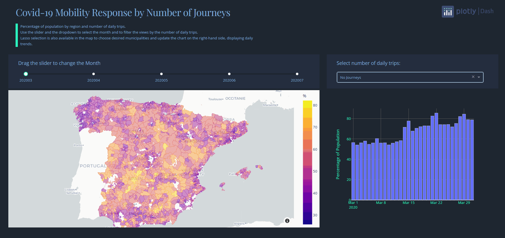

### Covid-19 Mobility Response in Spain

A few months ago, the Spanish minister of transport published anonymous and aggregated journey data on trips taken during the Covid-19 pandemic. These datasets were derived from signal records on the mobile phone network.

This repository aims to create an interactive dashboard to present and analyze some of the aforementioned data in a dynamic and engaging manner.

The dashboard provides the user with the percentage of the population, categorized by municipality, that engaged in different numbers of trips. Users can select specific municipalities and explore their daily trends.

Clone the repository and install all library dependencies in your virtual environment:

```
pip install -r requirements.txt
```

Next, execute the file **run.py** and the following will occur:

1) Data will be downloaded and uploaded to the folder location "data/00_raw". This is achieved by invoking **data/extract_data.py** where a Selenium instance will be created to scrape the data from the official URL "https://www.mitma.gob.es/ministerio/covid-19/evolucion-movilidad-big-data/opendata-movilidad".
2) Subsequently, the raw data will be decompressed and stored in the folder "data/decompressed". This is accomplished by executing **data/decompress_raw_data.py**
3) After this, the module **data/data_to_csv.py** will be invoked to convert the decompressed data into CSV format. The resulting data files will then be stored inside the "data/02_csv" directory.
4) The module **maps/simplify_boundaries.py** is then run to simplify the geometries of the raw shapefiles containing the geospatial boundaries. This is done to reduce their weight and improve the rendering speed of the dynamic mapping in Dash.
5) The module **data/preprocessing.py** will then be called to combine the results of steps (3) and (4) and engineer metrics that will be used by the dashboard.The resulting file is uploaded to **data/03_preprocessed**.
6) Finally, the dash application **dashboard/dashboard.py** is launched in your web browser.


